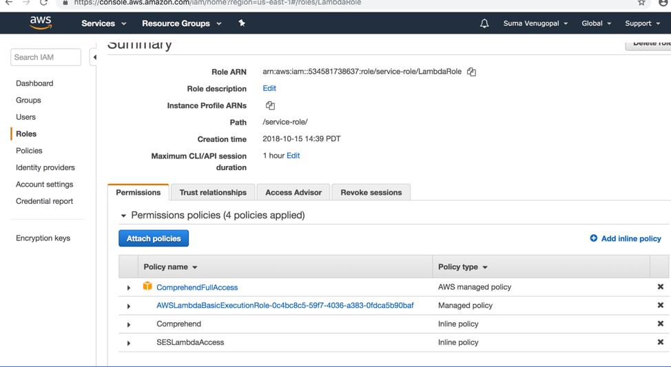

# NLP-Based-RealTime-Voicemail-Routing-System

## 1. Objective
### 1.1. Business UseCase

Timely response to huge number of voicemail messages received by enterprises like Health Insurance companies that have millions of customers is indeed a challenge in the real world and can be a defining factor when it comes to retaining customer base and  improving customer experience.

As in the case with any other IVR system, in Health Insurances companies too there is always an option for the caller to leave a voicemail if all the customer care representatives are busy, call volumes or wait times are high or if the user simply choses to be contacted later based on the voice mail. Lot of enterprises are still experimenting with novel technologies in an attempt to improve their voicemail handling capabilities and thus improve customer response times.

### 1.2. Project Proposal 

To address the business case detailed above, the proposal is to build an intelligent, real-time system that performs NLP (Natural Language Processing)  on voicemail texts and  route these voicemails to appropriate departments within the Health Insurance Company. The concerned departments will be notified via emails that will contain the key interpretations made by the system that can be used in prioritizing responses and actions. This will bring down the manual effort required to listen to these messages one by one to determine appropriate actions on each of the messages. 

## 2. Scope
### 2.1. In Scope

      Scope of the system is limited to the following:
1. Categorize a voicemail into English or Spanish.
2. Do sentiment analysis on the voicemail text and identify if the call had a positive, negative, mixed or neutral tone.
3. Based on the text analysis of the voicemail, identify which department within the Health Insurance company the voicemail should be routed to.
4. Identify the key entity name referred to in the voicemail if available.
5. Send real-time alert to concerned department, with the above details within seconds of receiving the voicemail.
6. Moving copies of processed voicemail transcripts to archival location.
7. Business areas covers within healthInsurance  - claims, benefits, pharmacy, health exchanges, provider

### 2.2. Out of Scope
      Following capabilities are not in scope:
1. Input for this project would be voice mail text transcripts. An audio to text transcription service that outputs voicemail texts can be integrated to the proposed system to produce source data if needed. But this will not be implemented as part of this project. Integrating transcription  can be a future enhancement.
2. Handling of voicemails in languages other than English and Spanish are out of scope and can be a future enhancement

## 3. Overview of Functionality

Overview

## 4.  Distinguishing Features

There might be existing capabilities that organizations possess , when it comes to simply routing voicemails based on some minimal criteria. But what distinguishes this proposed application are the following added  capabilities that might not exist right now within the IT systems of most (if not any) of the Health Insurance companies:
- ability to do NLP on voicemail text to identify whether the voicemail is in English or Spanish
- ability to do NLP on voicemail text to identify a person referred to in the voicemail by name. 
- capability to do NLP on the voicemail text to perform sentiment analysis.
- ability to do NLP on voicemail text to identify key phrases, score them and route voicemail to appropriate department within the health insurance company based on highest aggregate score.
- ability to do the voicemail routing with the above NLP capabilities in real-time
- ability to trigger notification emails to the respective departments in real-time

## 5. Architecture 

Architecture

## 6. Pre-Requisites
Below are the pre-requisites necessary for the successful launch and execution of the application.

1. Involvement of an external entity(automated or manual)  to transcribe the voice mail into text file in real-time and drop it in the input location.
2. Application should be set up to run on an AWS account with all the necessary accesses provisioned.
3. AWS IAM access along with access keys and secret keys should be set up for the account on which the application would be set up to run from.
4. All the AWS services being used should be configured to run on the same region. Ex:US-EAST-1
5. Necessary IAM access roles should be defined and attached to the AWS services so that they can access each other.
6. The email IDs set up to send emails and receive emails should be verified with AWS SES prior to the initial run of the application.
7. Application should be supplied with an input file in the specified format mentioned above.
8. S3 folder structure with respective csv files having department email ids, department identification data in specific .txt files etc should be set up prior to the application run

## 7. Technical Components
      Listed below are the different technical components related to  the 
      implementation.
### Platform
Amazon Web Services (AWS) Cloud 

### AWS Services Used 
1. AWS S3 (Simple Storage Service) for storing incoming voicemail text files and for archiving processed files
2. AWS Lambda serverless compute for launching the application when a voicemail is received
3. AWS Comprehend for NLP
4. AWS Simple Email Service (SES) for sending real-time email notifications
5. AWS Identity and Access Management (IAM) for provisioning necessary access to different components
6. AWS Cloudwatch Logs for application troubleshooting and testing

### Language
Python 2.7
### Python Packages
Json
Urllib
boto3
botocore
datetime

## 8. Input and Output Specifications
### Input
Voicemail transcript in UTF-8 format Ô.txtÕ file.
File is expected to be named with the date and timestamp when the voicemail was received.

Example a voicemail received on 25th Dec 2018 1.30 pm will be  named Ô12-25-18 1330.txtÕ
### Output
An email alert in the following format sent to the identified department:

Email Subject:
New Voicemail ALERT: [Received: 'vm received timestamp'; About: 'Identified Entity Name'; Language: 'dentified language'; Sentiment: 'Ôdetected sentiment']

Email Body:
Received this voicemail related to your department. Please take necessary action ----->>>>>>>>>>>>>>>>> VOICEMAIL TEXT IS : ÔIncoming voicemail text.'<<<<<<<<<<<<<<<<<<-----

## 9. End to End Process Flow

Below are the steps in the end-to-end process flow of the application, in the order in which they happen:

Flow

## 10. Application Set Up

Below are the steps to be followed to set up the application and get it running.

1. Set up an AWS account and IAM access for the user at the URL below:
https://portal.aws.amazon.com/billing/signup?id=acq886649&redirect_url=https%3A%2F%2Faws.amazon.com%2Fregistration-confirmation#/start

IAM user guide - https://docs.aws.amazon.com/IAM/latest/UserGuide/id_roles_create_for-user.html

Login to the userÕs AWS account  in the AWS Console, navigate to S3 service and create all the below S3 buckets  shown below with PUBLIC access . Use ÔAWS S3 folder structureÕ folder in the project repository as reference. Copy over the necessary txt and csv files as well from within the vmdeptemailidbucket and vmtrainbucket respectively. 

The below details are configurable:
Department specific csv files can be modified to include more terms related to each department.
AWS SES verified sender and recipient email ids need to be updated in the csv files. 

The vmreceivebucket and vmarchivebucket can be empty initially.

AWS URL with bucket create instructions - https://docs.aws.amazon.com/AmazonS3/latest/user-guide/create-bucket.html
(In real world more complex VPC settings need to be in place to restrict access. For now we can use PUBLIC access setting)

Picture1

Picture2

Picture3

2. Create a new Lambda  function called ÔS3LambdaÕ in Python 2.7 and copy paste the S3lambda.py source code (from the src folder within project repository) into this Lambda function as shown below.

Lambda should be created with the below settings and all necessary IAM access including full access to AWS comprehend.

Details on how to set up a Lambda serverless function and its IAM roles is present in this AWS documentation - https://docs.aws.amazon.com/lambda/latest/dg/welcome.html

Picture4

Picture5

Picture6

Picture7

Picture8

Picture9

Picture10

3. Add an event trigger to the ÔvmreceivebucketÕ. This is the input bucket where the voicemail text files will come in. The moment the file hits this bucket, the trigger executes and launches the ÔS3LambdaÕ, which executes the Python script for the application. How this is achieved in our application is illustrated via screenshots below.

More details on how to set up a Lambda based on S3 event is present in the AWS documentation here - https://docs.aws.amazon.com/lambda/latest/dg/invoking-lambda-functions.html

Picture11

4. Set up the sender and recipient email IDS in Amazon SES.
URL - https://console.aws.amazon.com/ses/

Picture12

## 11. User Guide

### Step1:

Obtain a sample voice mail clipping from US HealthInsurance domain pertaining to member benefits , provider, HIX, pharmacy or claims.

### Step2:
Create a voicemail transcript of the chosen file. File to be named with the date and timestamp when the voicemail was received.

Example a voicemail received on 25th Dec 2018 1.30 pm is expected to be  named Ô12-25-18 1330.txtÕ

Sample text transcript file is shown below.

Picture13

### Step3:

Upload the text file to the vmreceivebucket.

Picture14

Picture15

### Step 4:

Once the VM file hits the S3, this triggers the lambda and  python script within executes, to send the notification email as shown below.

Since the test input is related to membership benefits, the python code identified that from key terms within the vm text based on data configured within the vmtrainbucket. Then it immediately triggers the below email to the email id configured within the ÔBenefitDeptEmailDL.txtÕ file. All these happen within a few seconds.

Picture16

Picture17

### Step 5:

Once processing is complete, the input vm file gets moved to the archival S3 bucket Ð vmarchivebucket. 

Picture18

## 12. Benefits
Proposed system will have the following benefits from a Health Insurance enterprise perspective:
1. Capability to analyzed missed calls from voicemail text and notify respective department along with sentiment, date, person entity and voicemail content details within a few seconds.
2. Enables faster response by alerting the concerned department about the customerÕs issue for a fast resolution and improved customer experience.
3. Contribute towards prioritizing customer responses.
4. Each department can configure the data based on which the calls need to be routed by modifying the department related .csv files within vmtrainbucket without touching the actual code.
5. Each department can configure the department email ids in .txt files within the S3 bucket without touching the actual code.

## 13. Future Enhancements
1. Typical voicemail size is small with just two or three sentences, but still Text Summarization can be added to handle bigger Voicemails.

2. Topic modeling can be incorporated to identify the call volumes and topics of major interest related to each department. This can generate business insights and prioritize areas within each department that need immediate attention or fix.

3. Since NLP was the major focus of the project, scope was limited to processing voicemail text transcripts. The application can be enhanced by integrating it with a component that can transcribe the voicemail files into text files. Amazon Transcribe is a good choice for creating that  component considering the entire application runs on AWS.

4. Amazon Comprehend team recently announced custom classification and custom entity recognition which can be used to train the model further to enhance its healthcare entity recognition capabilities.

5. Right now this application covers the following areas within Health Insurance  - claims, benefits, pharmacy, health exchanges, provider. This can be extended to other areas or departments like appeals department, utilization management department, medicare department etc.

